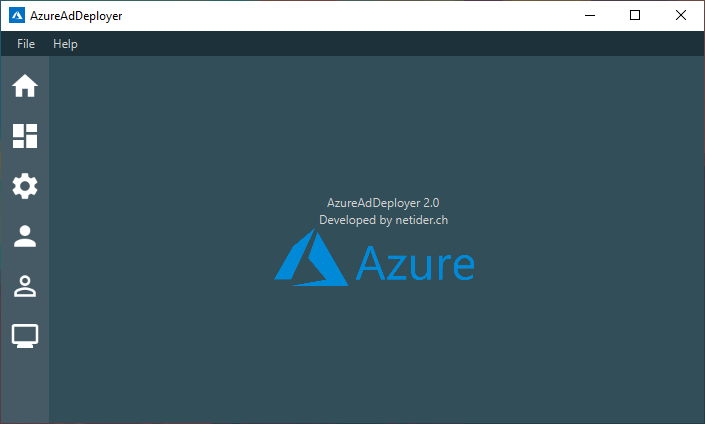
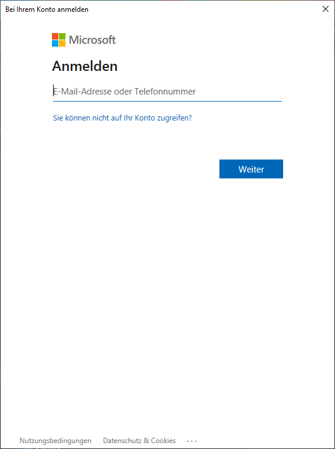
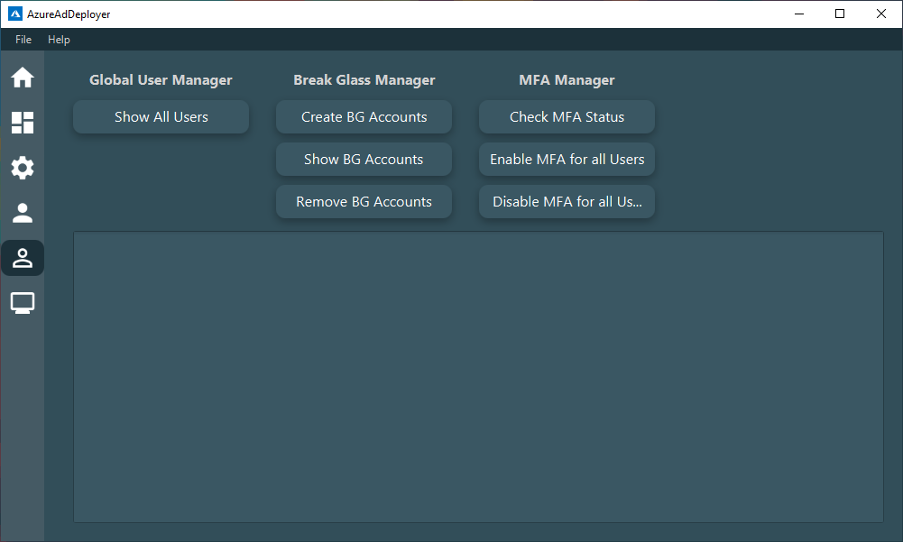
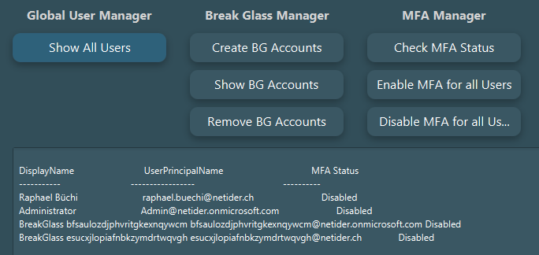
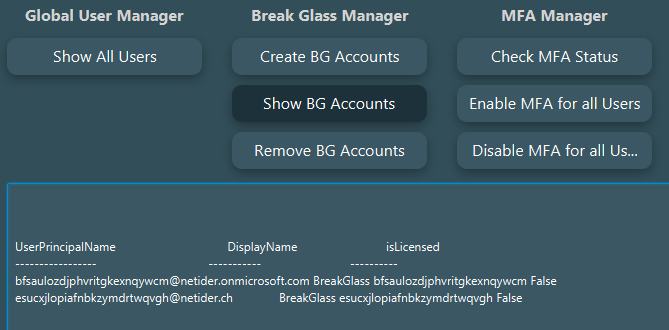
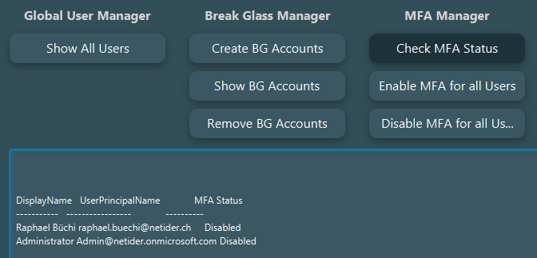
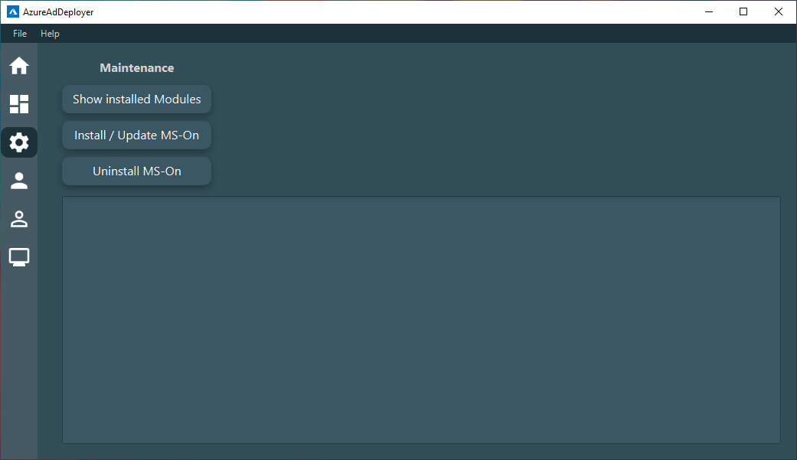
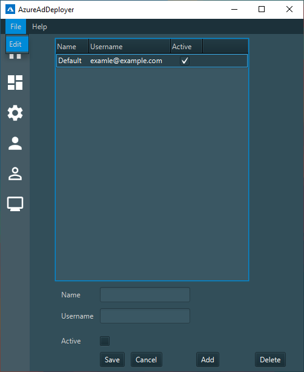
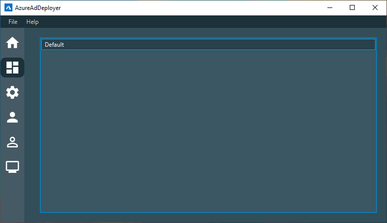
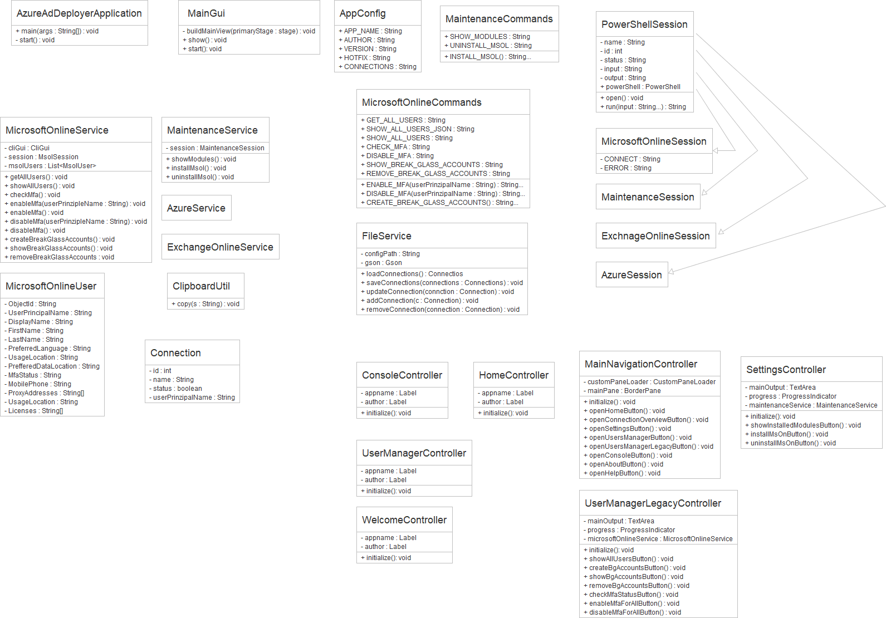

**AzureAdDeployer 2.0**

**Inhalt**

[1	AzureAdDeployer 2.0](#_Toc64457030)

[2	Features](#_Toc64457031)

[2.1	Legacy User Manager](#_Toc64457032)

[2.1.1	Global User Manager](#_Toc64457033)

[2.1.2	Break Glass Account Manager](#_Toc64457034)

[2.1.3	MFA Manager](#_Toc64457035)

[2.2	Settings](#_Toc64457036)

[2.3	Connection Manager](#_Toc64457037)

[3	Projekt](#_Toc64457038)

[3.1	Requirements](#_Toc64457039)

[4	Klassendiagramm](#_Toc64457040)

# **AzureAdDeployer 2.0**
Alles schreit heute nach modernen Cloudlösungen, deshalb hatte ich mich ein CLI-Tool für die moderne, Feature reiche und skalierbare Cloud Lösung «Azure» von Microsoft zu entwickeln. Der AzureAdDeployer in der Version 1.0 konnte durch ein CLI-Interface im Zusammenhang mit der User-Verwaltung im Azure Active Directory übernehmen und effizient ausführen.

In der Version 2 wurde die Applikation nun durch ein Grafisches User Interface und Persistenter Datenhaltung erweitert.
# **Features**
Folgende Features sind in der Version 2.0 verfügbar:

- Alle Azure Benutzer anzeigen
- Multi-Faktor-Authentifizierung verwalten (anzeigen / aktivieren / deaktivieren)
- PowerShell Module verwalten (installieren / aktualisieren / deinstallieren)
- Connections erstellen und verwalten (Noch keine Funktion)

Die Applikation wird stehts weiterentwickelt und mit neuen Features bestückt.

*Abbildung  SEQ Abbildung 1: Welcome*

Sobald das Tool eine Verbindung zu Azure aufbauen möchte, wird folgendes Pop-Up angezeigt:

*Abbildung  SEQ Abbildung 2: Azure Login*
Aktuell kann nur eine Verbindung aufgebaut werden, somit kann nur ein Azure Active Directory verwaltet werden. Das Tool kann jedoch problemlos mehrmals gestartet werden.
# **Legacy User Manager**
Der «Legacy User Manager» ist aus dem Hauptmenü mit einem Klick auf das 2. User Symbol erreichbar. Es wurden hier alle Legacy User Management Funktionen aus der Version 1 implementiert.

In Zukunft sollte die User Verwaltung jedoch durch den neuen User Manager (1. Symbol) ersetzt werden.

*Abbildung  SEQ Abbildung 3: Legacy User Manager*
# **Global User Manager**
Es ist möglich alle Benutzer, welche im Azure AD vorhanden sind, übersichtlich anzeigen zu lassen. Zusätzlich wird noch der MFA Status (Multi-Faktor-Authentifizierung) angezeigt.

*Abbildung  SEQ Abbildung 4: Global User Manager*
# **Break Glass Account Manager**
Es ist möglich die Break Glass Accounts im Azure AD zu erstellen, anzeigen oder löschen.

Break Glass Accounts sind Administratoren Accounts welche für die emergency recovery benötigt werden, falls der Zugriff über die regulären Administratoren Accounts nicht mehr funktioniert.

*Abbildung  SEQ Abbildung 5: Break Glass Account Manager*
# **MFA Manager**
Es ist möglich die Multi-Faktor-Authentifizierung zu überprüfen, aktivieren oder deaktivieren. Dis kann gleichzeitig direkt für alle User durchgeführt werden.

*Abbildung  SEQ Abbildung 6: MFA Manager*

# **Settings**
Die Settings sind aus dem Hauptmenü mit einem Klick auf das Settings Icon erreichbar. Es ist möglich die benötigten PowerShell Module zu installieren, deinstallieren oder zu aktualisieren.

*Abbildung  SEQ Abbildung 7: Settings*

# **Connection Manager**
Aktuell ist dieses Feature noch nicht fertig implementiert und auch noch nicht funktionsfähig.

Die Idee ist es, mehrere Kunden als «Connections» gleichzeitig zu verwalten. Somit sollte es in Zukunft möglich sein, einen Befehl gleichzeitig für mehrere Kunden auszuführen oder mehrere Verbindungen zu unterschiedlichen Kunden zu öffnen.

Die Connections können aktuell über /File/Edit verwaltet werden. Teilweise werden dir Verbindungen jedoch noch überschrieben und das Ändern funktioniert nicht immer. 

Beispiel Pfad Windows: [%LOCALAPPDATA%/netider.ch/AzureAdDeployer](%25LOCALAPPDATA%25/netider.ch/AzureAdDeployer)

*Abbildung  SEQ Abbildung 8: Edit / Add / Delete Connections*

Zusätzlich sollten die Connections dann im «Connection Dashboard» aufgelistet werden. Von dort aus sollte dann die entsprechende Connection auch direkt geöffnet werden können.

*Abbildung  SEQ Abbildung 9: Connections Dashboard*
# **Projekt**
Der offene Quellcode kann in folgendem Repository angeschaut werden: <https://github.com/swissbuechi/AzureAdDeployer>

Da das Projekt in der Firma Dreikom AG produktiv eingesetzt wird, habe ich die Spezial Bewilligung erhalten, gewisse zwingend Notwendige Features mit Libraries zu implementieren.

Das Projekt wurde mit Java 11 entwickelt.

Für die PoweShell Implementierung wurde die PowerShellLibJava[^1] Library von Tuupertunut verwendet.

Damit JSON Objekte geparst werden können (wird aktuell noch nicht benötigt) wird die GSON[^2] Library von Google verwendet.

Zusätzlich wurde eine Library namens appdirs[^3] für das Bestimmen vom Betriebsystemabhängigen lokalen «appdata» Ordner verwendet. Der Code könnte auch durch einen lokalen Pfad ersetzt werden. Da die Applikation jedoch Plattformunabhängig und in Kombination mit Active Directory Roaming Profilen genutzt wird, ist diese Library zwingend notwendig.

Für das Realisieren von einem ansprechenden Designe, wurde für die Buttons die JavaFX Library jfoenix[^4] verwendet. Theoretisch könnten alle JFXButtons auch durch normale Buttons ersetzt werden. Dann geht jedoch die Material Designe Animation beim Betätigen vom Button verloren.
# **Requirements**
Es ist PowerShell in der Plattformunabhängigen Core variante notwendig und eine Java JRE in der Version 11 mit JavaFX Unterstützung.

# **Klassendiagramm**

*Abbildung  SEQ Abbildung 10: Klassendiagramm Komplett*

[^1]: <https://github.com/Tuupertunut/PowerShellLibJava>
[^2]: <https://github.com/google/gson>
[^3]: <https://github.com/harawata/appdirs>
[^4]: <https://github.com/sshahine/JFoenix>

    